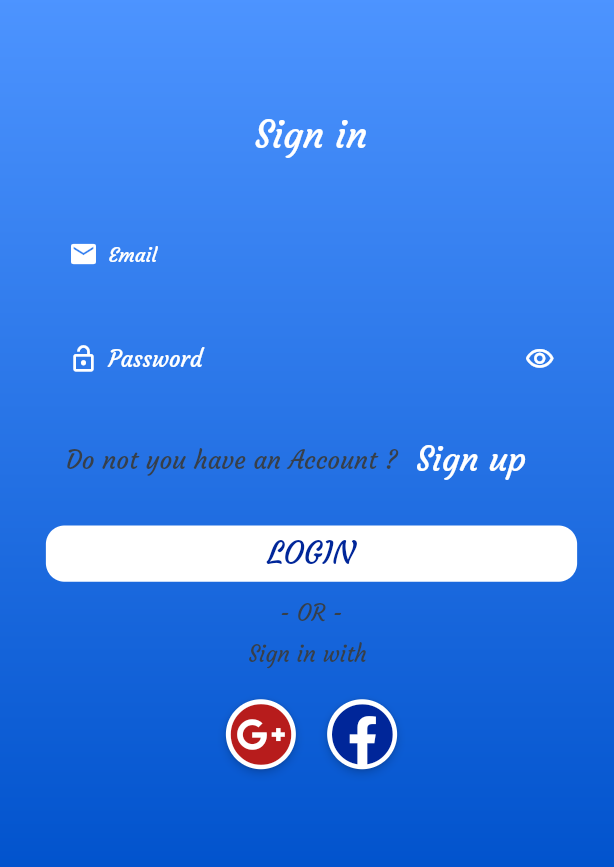
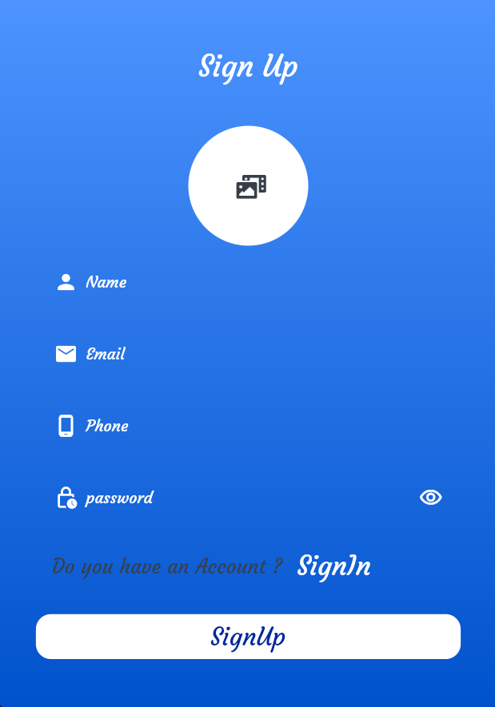
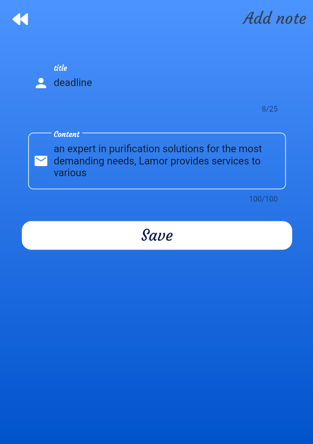
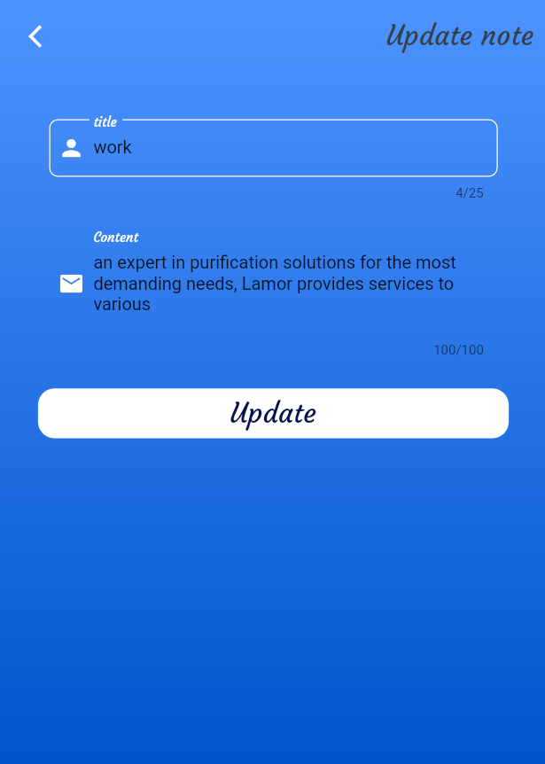
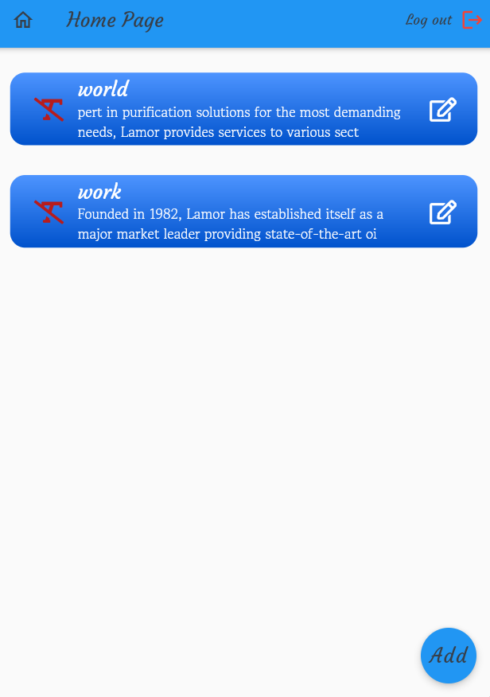

# note_app
This application uses the firebase for storage, also supports the Arabic 
and English languages and includes two modes : - light and dark modes .
## package 😄
~~~ packages
  jiffy: ^4.1.0
  image_picker: ^0.8.2
  http: ^0.13.3
  shared_preferences: ^2.0.6
  firebase_core: ^1.4.0
  firebase_storage: ^10.0.1
  cloud_firestore: ^2.4.0
  firebase_messaging: ^10.0.4
  firebase_auth: ^3.0.1
  awesome_dialog: ^2.1.0
  dropdown_search: ^0.6.3
  google_sign_in: ^5.0.5
  lottie: ^1.1.0
  font_awesome_flutter: ^9.1.0 
  url_launcher: ^6.0.9
  flutter_rating_bar: ^4.0.0
  get: 
~~~

## screenshots 🙂

