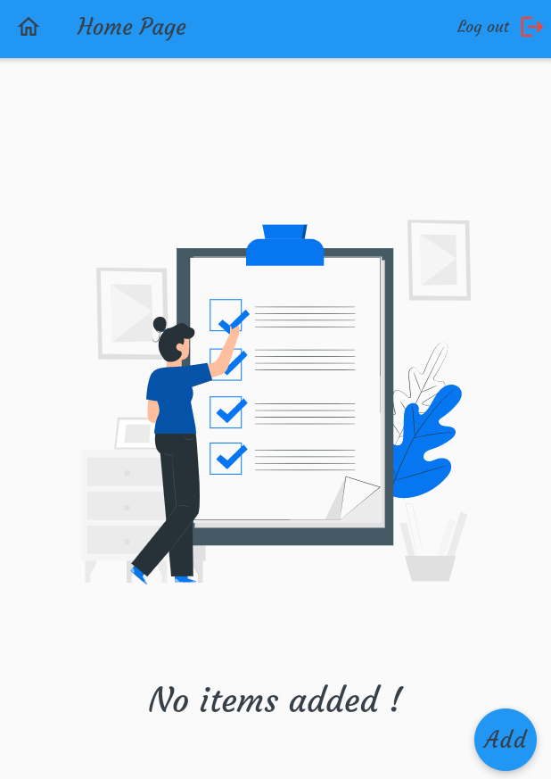

# note_app
This application uses the firebase for storage, also supports the Arabic 
and English languages and includes two modes : - light and dark modes .
## package 😄
~~~ packages
  jiffy: ^4.1.0
  image_picker: ^0.8.2
  http: ^0.13.3
  shared_preferences: ^2.0.6
  firebase_core: ^1.4.0
  firebase_storage: ^10.0.1
  cloud_firestore: ^2.4.0
  firebase_messaging: ^10.0.4
  firebase_auth: ^3.0.1
  awesome_dialog: ^2.1.0
  dropdown_search: ^0.6.3
  google_sign_in: ^5.0.5
  lottie: ^1.1.0
  font_awesome_flutter: ^9.1.0 
  url_launcher: ^6.0.9
  flutter_rating_bar: ^4.0.0
  get: 
~~~

## screenshots 🙂





# This method is used in route management *mix bettween flutter and GetX*
  - This method is not the best thing 
  
```dart
import 'package:firebase_auth/firebase_auth.dart';
import 'package:get/get.dart';
import 'package:flutter/material.dart';
import 'package:star/add_note.dart';
import 'package:star/home_page.dart';
import 'package:star/setting.dart';
import 'package:star/sign_in.dart';
import 'package:star/sign_up.dart';
import 'package:star/verification_email_screen.dart';


class AppRoutes {
  static const String mainDirectTo = "/";
  static const String signINScreen = "/signINScreen";
  static const String signUpScreen = "/SignUp";
  static const String homePageScreen = "/HomePage";
  static const String addNoteScreen = "/AddNote";
  static const String emailVerificationScreen = "/emailVerificationScreen";
  static const String settingsScreenScreen = "/Settings";
}

class AppRouteGenerator {
  //====  manage route ======//
  static Route<dynamic> getRoute(RouteSettings settings) {
    switch (settings.name) {
     
     ///======== mainDirectTo  [To check Login status] ===============//
      

        case AppRoutes.mainDirectTo:
        
        if (FirebaseAuth.instance.currentUser == null
            ) {
         return GetPageRoute(
            page: () => SignIN(),
          );
        }
        else{
         if (FirebaseAuth.instance.currentUser!.emailVerified == true) {
          return GetPageRoute(
            page: () => HomePage(),
          );
          
        } else {
           return GetPageRoute(
            page: () => EmailVerificationScreen(),
          );
        }
        }
        //=====================================================//
      case AppRoutes.signINScreen:
        return GetPageRoute(page: () => SignIN());
      case AppRoutes.signUpScreen:
        return GetPageRoute(page: () => SignUP());
      case AppRoutes.homePageScreen:
        return GetPageRoute(page: () => HomePage());
      case AppRoutes.addNoteScreen:
        return GetPageRoute(page: () => AddNote());
      case AppRoutes.emailVerificationScreen:
        return GetPageRoute(page: () => EmailVerificationScreen());
      case AppRoutes.settingsScreenScreen:
        return GetPageRoute(
          page: () {
            final args = settings.arguments as String;
            return Settings(
              data: args,
            );
          },
        );

      default:
        return unDefinedRoute();
    }
  }

  //== to handel route ==//
  static GetPageRoute<dynamic> unDefinedRoute() {
    return GetPageRoute(
      page: () => Scaffold(
        appBar: AppBar(
          title: const Text("No Route Found"),
        ),
        body: const Center(child: Text("No Route Found")),
      ),
    );
  }
}
```

```dart
import '../core/utils/routes.dart';
import '../translation/translation.dart';

class NoteApp extends StatelessWidget {
  //========== singleton ===============//
  const NoteApp._internal();
  static const NoteApp instance = NoteApp._internal();
  factory NoteApp() {
    return instance;
  }
  //===================================//
  @override
  Widget build(BuildContext context) {
    Get.changeTheme(ThemeController().isDark ?ThemeData.dark():ThemeData.light());
    return GetMaterialApp(
      locale: Locale('en'),
      fallbackLocale: Locale('en'),
      translations: Localization(),
      debugShowCheckedModeBanner: false,
      title: "NoteApp",
      theme: ThemeData(
        primarySwatch: Colors.blue,
      ),
      initialRoute: AppRoutes.mainDirectTo,
      darkTheme: ThemeData.dark().copyWith(primaryColor: Colors.red),
      onGenerateRoute: (RouteSettings settings) =>
          AppRouteGenerator.getRoute(settings),
    );
  }
}
```

```dart


class FirebaseAuthenticationStatus {
  static UserAuthenticationStatus getTheStatus() {
   
    UserAuthenticationStatus loginStatus =
        UserAuthenticationStatus.isNotAuthenticated;
   
    User? user = FirebaseAuth.instance.currentUser;
   
   
    if (user == null) {
      loginStatus = UserAuthenticationStatus.isNotAuthenticated;
    } else if (!user.emailVerified) {
      loginStatus = UserAuthenticationStatus.isAuthenticated;
    } else {
      loginStatus = UserAuthenticationStatus.isAuthenticatedAndEmailVerified;
    }
    debugPrint(user?.email);
    debugPrint(user?.emailVerified.toString());
    debugPrint(loginStatus.toString());

    return loginStatus;
  }
}

enum UserAuthenticationStatus {
  isAuthenticatedAndEmailVerified,
  isAuthenticated,
  isNotAuthenticated
}

```